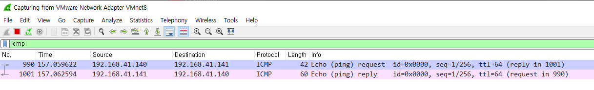
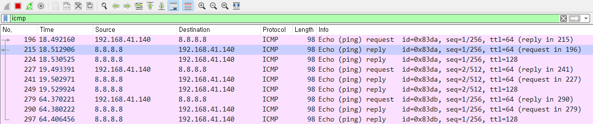
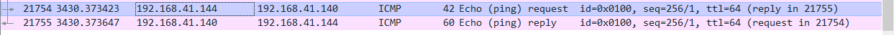
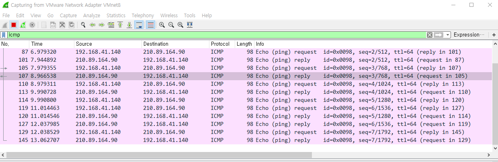

# Task 02 (Packet Sniffing and Spoofing) Task Report Submission


## Author

- **Student ID**: 2017270718
- **Name**: Chanhee Park
- **GitHub ID**: ch4rli3kop


## Task 1.1: Sniffing Packets

### Task 1.1A

```python
#!/usr/bin/python3

from scapy.all import *

def print_pkt(pkt):
	pkt.show()

pkt = sniff(filter='icmp', prn=print_pkt)
```

When run program with root privilege and send 'ICMP' packet with ping program, the program print packet's detail. But without root privilege, the program doesn't access the kernel buffer, so it makes error. It's result is in **terminal_dump/task_1.1A**

### Task 1.1B

#### Capture only the ICMP packet

```python
...
pkt = sniff(filter='icmp', prn=print_pkt)
```

It's result is in __terminal_dump/task_1.1B_1.txt__

#### Capture any TCP packet that comes from a particular IP and with a destination port number 23

```python
...
pkt = sniff(filter='tcp and src net 192.168.41.1 and dst port 23', prn=print_pkt)
```

The protocol using port 23 is __Telnet__. So, I access VM with telnet and capture that.

It's result is in __terminal_dump/task_1.1B_2.txt__

#### Capture  packets  comes  from  or  to  go  to  a  particular  subnet.   You  can  pick  any  subnet,  such  as128.230.0.0/16; you should not pick the subnet that your VM is attached to.

```python
...
pkt = sniff(filter='dst net 192.168.41.144 mask 255.255.255.255', prn=print_pkt)
```

It's result is in __terminal_dump/task_1.1B_3.txt__


## Task 1.2: Spoofing ICMP Packets

```python
#!/usr/bin/python3
from scapy.all import *

a = IP()
a.src = '192.168.41.140'
a.dst = '192.168.41.141'
b = ICMP()
p = a/b
p.show2()
send(p)
```

__Spoofer__ : 192.168.41.144
__Target__ : 192.168.41.140
__Dst__ : 192.168.41.141

I change packet's src ip and spoof target. As shown below, I can see __Dst__ send __echo-reply__ to __Target__.



It's result is in __terminal_dump/task_1.2.txt__


## Task 1.3: Traceroute

__First of all__,  I set VM network configuration as **bridge**. Thay way I can __receive the error packet__ from routers between host and target. 

I target __the Google DNS Server (8.8.8.8)__ and set the max TTL value to 14 developing with __sr()__ from Scapy.

Here is my code:

```python
#!/usr/bin/python3
from scapy.all import *

TARGET = '8.8.8.8'
MAX_TTL = 14
TIMEOUT = 1.5

ip = IP()
icmp = ICMP()

ip.dst = TARGET

ip.ttl = (1,MAX_TTL)
p = ip/icmp
ans, uans= sr(p, timeout=TIMEOUT)

for snd, rcv in ans:
	result = str(snd.ttl) + '\t' + rcv.src
	if rcv.src == TARGET:
		result += ' \t <== TARGET!'
        	print(result)
        	break
	print(result)
```

The execution result is below, and the result is in __terminal_dump/task_1.3.txt__

```shell
[05/06/20]seed@VM:~/tmp$ sudo ./task1_3.py 
Begin emission:
...*.**..**..*.*.Finished sending 14 packets.
..*.*.**.*.....................................
Received 64 packets, got 12 answers, remaining 2 packets
1	192.168.0.1
2	121.127.139.193
3	172.20.135.241
4	211.247.0.81
5	192.168.64.73
6	211.210.54.110
7	10.222.14.52
8	72.14.204.124
9	209.85.253.59
10	8.8.8.8 	 <== TARGET!
```


## Task 1.4: Sniffing and-then Spoofing

```python
#!/usr/bin/python3
from scapy.all import *

TARGET = '192.168.41.140'
spoof_ip = '8.8.8.8'

def spoof(pkt):
	pkt.show()
	ip = IP()
	ip.src = spoof_ip
	ip.dst = TARGET
	icmp = ICMP()
	icmp.type = 'echo-reply'
	icmp.id = pkt[2].id
	icmp.seq = pkt[2].seq
	p = ip/icmp/pkt[3]
	send(p)

pkt = sniff(filter='icmp[icmptype] == icmp-echo', prn=spoof)
```

Since each __Identifier__ and __Sequence Number__, __ICMP's data__ of request/reply must be same, I configured the code as above.

And when the program run, I can identify the echo-reply is spoofed as below.




## Task 2.1: Writing Packet Sniffing Program

### Task 2.1A: Understanding How a Sniffer Works

#### Question 1. 

By using `pcap_open_live()` program gets __the pcaket capture descriptor__ about network interface. 

And program generate __the packet filter__ with `pcap_compile()` and apply it to __filter rule__ with `pcap_setfilter()`.

The packet filtered is entered repeatedly with `pcap_loop()` and it processed by registered handler function.

Last, close the handle with `pcap_close()`.

#### Question 2.

When the program  turn on the promiscuous mode, the root privilege is required. And else, when accessing the network interface or buffer related kernel, it required too. 

The Program failed at `pcap_compile()` when I test it.

#### Question 3.

I checked that by printing packet's src and dst ip. With promiscuous mode, sniffer capture all packets in LAN, But without promiscuous  mode, sniffer only capture packets passing inside it's VM.

It's code is __task2_1A.c__, and the result is in __terminal_dump/task2_1A.txt__.


### Task 2.1B: Writing Filters.

#### Capture the ICMP packets between two specific hosts

```c
...
char filter_exp[] = "(ip proto icmp) and (host 192.168.41.140 and 8.8.8.8)";
...
```

#### Capture the TCP packets with a destination port number in the range from 10 to 100.

```c
...
char filter_exp[] = "tcp dst portrange 10-100";
...
```

Both result is in __terminal_dump/task_2.1B*.txt__


### Task 2.1C: Sniffing Passwords.

```c
...
void got_packet(u_char *args, const struct pcap_pkthdr *header, const u_char *packet){
        pEth eth = (pEth) packet;
        pIp ip;
        pTcp tcp;
        int data_len;
        char buf[0x1000];
        char src[0x20];
        char dst[0x20];

        if (ntohs(eth->type) == 0x0800) ip = (pIp)(packet + sizeof(Eth));
        else return;

        if (ip->protocol == 0x6) tcp = (pTcp)(packet + sizeof(Eth) + sizeof(Ip));
        else return;

        if (ntohs(tcp->src_port) == 23 || ntohs(tcp->dst_port) == 23){
                printf("\n### Telnet ###\n");
                ip_addr(ip->src_ip, src);
                ip_addr(ip->dst_ip, dst);
                printf("%s  ->  %s\n", src, dst);
                data_len = ntohs(ip->length) - sizeof(Ip) - sizeof(Tcp);
                printf("Data len : %d\n", data_len);
                memcpy(buf, (char*)(packet + sizeof(Eth) + sizeof(Ip) + sizeof(Tcp)), data_len);
                buf[data_len] = '\x00';
                printf("Data : \n%s\n", buf);
        }
}
...
```

I write the code as above, and I captured the plain password __"dees"__. Its result is in __terminal_dump/task_2.1C.txt__.

```shell
...

### Telnet ###
192.168.41.144  ->  192.168.41.1
Data len : 12
Data :
^M
Password:

### Telnet ###
192.168.41.1  ->  192.168.41.144
Data len : 0
Data :


### Telnet ###
192.168.41.1  ->  192.168.41.144
Data len : 1
Data : 
d

### Telnet ###
192.168.41.144  ->  192.168.41.1
Data len : 0
Data : 


### Telnet ###
192.168.41.1  ->  192.168.41.144
Data len : 1
Data : 
e

### Telnet ###
192.168.41.144  ->  192.168.41.1
Data len : 0
Data : 


### Telnet ###
192.168.41.1  ->  192.168.41.144
Data len : 1
Data : 
e

### Telnet ###
192.168.41.144  ->  192.168.41.1
Data len : 0
Data : 


### Telnet ###
192.168.41.1  ->  192.168.41.144
Data len : 1
Data :
s

...
```


## Task 2.2: Spoofing

### Task 2.2A: Write a spoofing program.

### Task 2.2B: Spoof an ICMP Echo Request.

I writed the code that covers both task 2.2A and task 2.2B. It is in __task2_2.c__. 

Except the part of calculating checksum, it is my own code.



#### Question 4. Can you set the IP packet length field to an arbitrary value, regardless of how big the actual packet is?

No, no matter how I overwrite big number, it is automatically set to original packet size.

#### Question 5. Using the raw socket programming, do you have to calculate the checksum for the IP header?

Maybe No. But, it seems to be different in some cases. As a result of my testing, I confirmed that the communication works normally even if the checksum of IP header is not correct.

#### Question 6. Why do you need the root privilege to run the programs that use raw sockets?  Where does the program fail if executed without the root privilege

I think it is because the raw sockets is processed by a processer other than the existing (TCP or UDP) processor. And as Security Problem, the raw sockets is limited by root privilege.


## Task 2.3: Sniff and then Spoof

Here is my environment :

```shell
192.168.41.144 : Sniff and Spoof program is running
192.168.41.140 : ping www.naver.com
210.89.164.90 : www.naver.com
```

__www.naver.com__ does not provide __echo-reply__ using __ping__ as follows.

```shell
ch4rli3kop at ubuntu in ~
$ ping naver.com
PING naver.com (210.89.164.90) 56(84) bytes of data.
64 bytes from 210.89.164.90 (210.89.164.90): icmp_seq=1 ttl=64 time=941 ms
64 bytes from 210.89.164.90 (210.89.164.90): icmp_seq=2 ttl=64 time=966 ms
64 bytes from 210.89.164.90 (210.89.164.90): icmp_seq=3 ttl=64 time=987 ms
64 bytes from 210.89.164.90 (210.89.164.90): icmp_seq=4 ttl=64 time=1011 ms
64 bytes from 210.89.164.90 (210.89.164.90): icmp_seq=5 ttl=64 time=1024 ms
64 bytes from 210.89.164.90 (210.89.164.90): icmp_seq=6 ttl=64 time=1023 ms
^C
--- naver.com ping statistics ---
7 packets transmitted, 6 received, 14% packet loss, time 6059ms
rtt min/avg/max/mdev = 941.006/992.364/1024.004/30.861 ms, pipe 2
```

However, __the sniff and spoof program__ sends __echo-reply__, so  I can confirm the result as below. The program code is in __task2_3.c__ and the result is in __terminal_dump/task_2.3.txt__.




